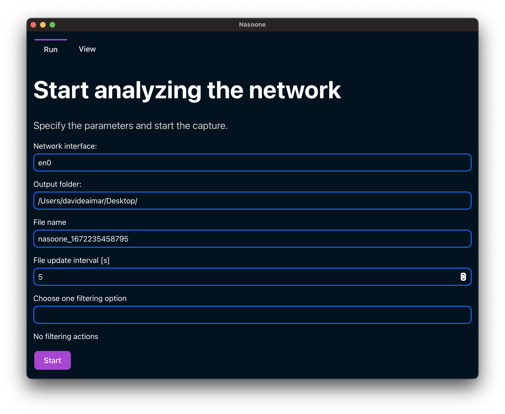
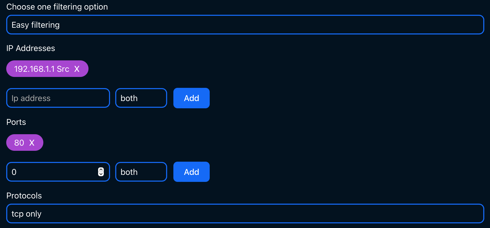
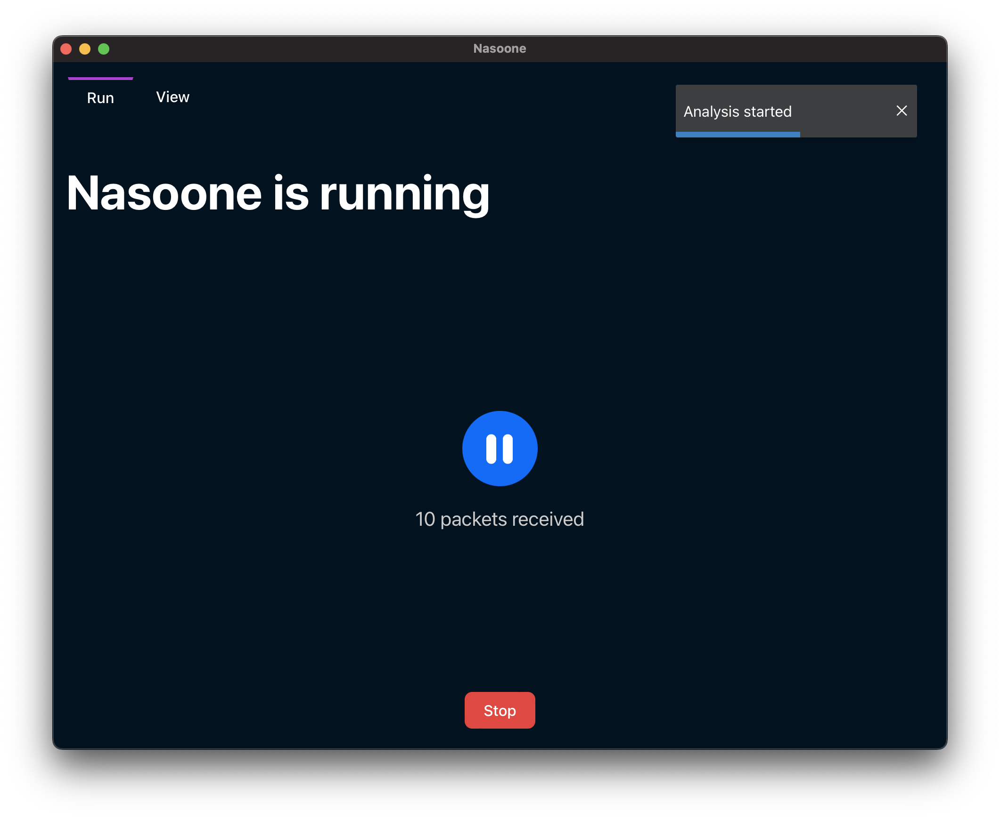
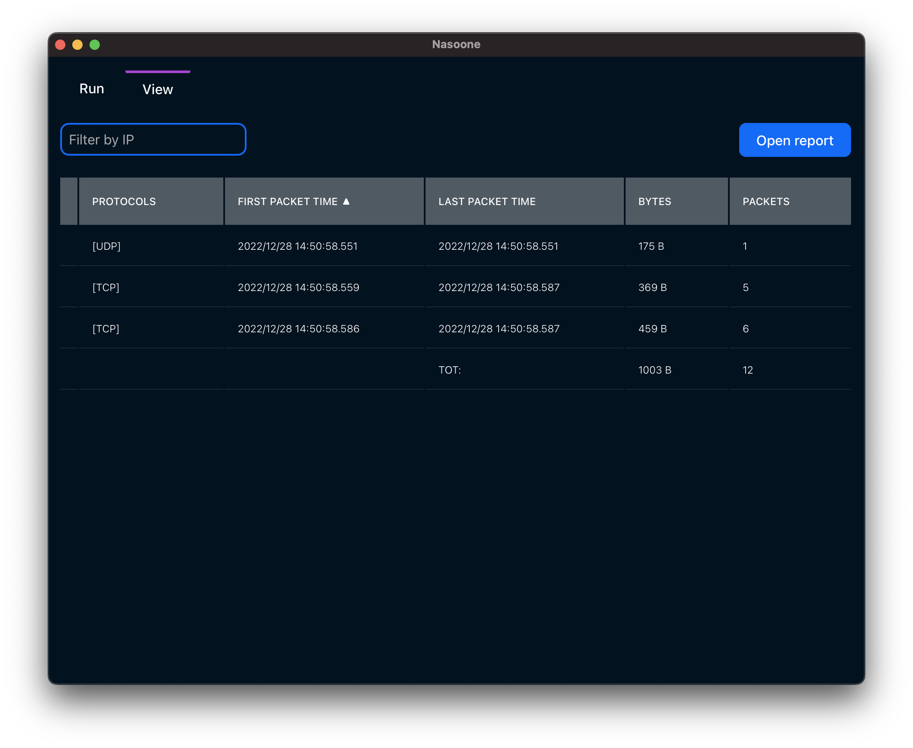

Nasoone is an application that allows you to collect statistics about the traffic in your network.

It is built with [Rust](https://www.rust-lang.org/) using the [Tauri](https://tauri.com/) framework for the GUI. The interface is built using [Svelte](https://svelte.dev/).

# Usage

## Installation

Download the latest release from the [releases page](https://github.com/davideaimar/nasoone/releases/) these binaries are built for Windows, Linux and MacOS by a Github Action.

To run Nasoone you need pcap installed on your system, it should be already installed if you have Wireshark on your system. You can find the instructions for your OS below.

### On Linux

On Debian you can install it with:

```bash
sudo apt install libpcap-dev
```
On Fedora you can install it with:

```bash
sudo dnf install libpcap-devel
```

**Note**: If not running as root, you need to set capabilities like so: sudo setcap cap_net_raw,cap_net_admin=eip path/to/pcap/bin.


### On MacOS

You should have it installed by default.

### On Windows

Check see the [npcap website](https://npcap.com/#download).

## UI

The UI is divided in two tabs:
 - **Run**: allows you to run and manage a capture of the network traffic.
 - **View**: allows you to open a report file and view the statistics.

### Run tab



The run tab allows you to run a capture of the network traffic. The capture accepts the following parameters:
 - **Network interface**: on which interface to run the capture.
 - **Output folder**: the folder where to save the report file.
 - **File name**: the name of the report file.
 - **File update interval [s]**: the interval in seconds at which the report file is updated (rewritten).
 - **Filter option**: the type of filter to apply to the capture. You can choose between:
   - **No filters**: no filter is applied.
   - **BPF**: you can write a raw filter following the [BPF syntax](https://biot.com/capstats/bpf.html).
   - **Easy filter**: you can specify filters graphically as shown below:
   
   Once you have specified the filter you can switch to the **BPF** option to see the equivalent BPF filter and add more complex parts.

Once the capture is running you can see in real time the amount of parsed packets. You can pause or stop the capture by clicking on the corresponding buttons.



You can also see all the statistics in real time by switching to the view tab and opening the report file.

### View tab



In this tab you can click on open report to open a report file and view the statistics. If the file is a live capture, it will be updated in real time. The last row of the table shows aggregated statistics.

You can filter by the IP address, it will match both the source and the destination IP address.

You can sort the table by clicking on the column headers.

## Development

To get started with development install the [Tauri prerequisites](https://tauri.app/v1/guides/getting-started/prerequisites) then open two terminals and run the following commands:

```bash
cd frontend
npm install
npm run dev
```

```bash
cd src-tauri
cargo tauri dev
```
